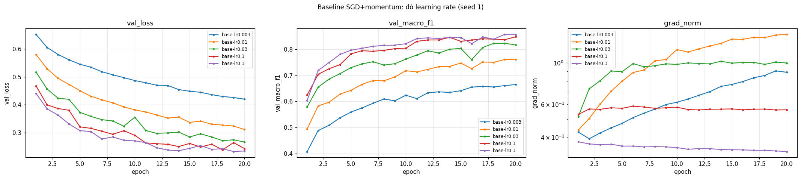
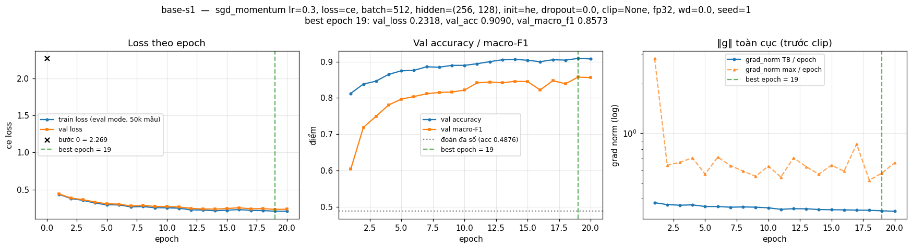
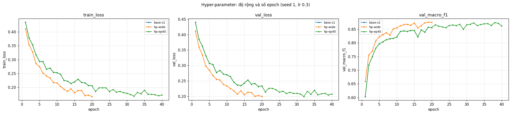
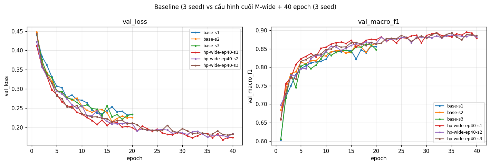

# Báo cáo Lab Day 1 — Đặng Hữu Tâm — 2A202602940

## 1. Thiết lập

- **Môi trường:** Google Colab, GPU Tesla T4, PyTorch 2.11.0+cu130. Code trong `code/`; notebook `code/lab.ipynb` chạy từ `submission_2A202602940/code/` (dữ liệu ở `../../data`, kết quả ghi `../figures`, `../results`).
- **Dữ liệu:** Forest CoverType; `train` 464 809 / `eval` 116 203 theo `split_metadata.csv` (chạy `scripts/split_data.py`, không sửa metadata). Validation: 20% của train, phân tầng, seed 42 → **371 847 train / 92 962 val**. Chuẩn hoá 10 cột số bằng mean/std **chỉ của phần train**; 44 cột nhị phân giữ nguyên.
- **Model:** `M-base` (54→256→128→7, **47 879 tham số**, `assert` ngay sau khi tạo). Baseline: CE, SGD + momentum 0,9, **lr = 0,3** (chọn bằng val), batch 512, 20 epoch, khởi tạo He (`kaiming_normal_`, fan_in), bias 0, dropout 0, không clip, FP32.
- **Cách đo:** train loss đo ở chế độ `eval()` trên một tập con **cố định 50 000 mẫu train**; best epoch = epoch có **val loss thấp nhất**, metric báo cáo tại epoch đó; `grad_norm` là chuẩn L2 toàn cục **trước khi clip**.
- **Mốc tham chiếu:** accuracy "đoán lớp đa số" trên val = **0,4876**.
- **Chủ đề đã thử:** ☐ loss ☐ optimizer ☑ **hyper-parameter** ☐ dropout ☐ clipping ☐ mixed precision ☐ init. Theo yêu cầu của giảng viên, bài chỉ thực hiện **một** chủ đề (hyper-parameter: learning rate, độ rộng, số epoch).

## 2. Kiểm tra ban đầu và độ nhiễu

| Kiểm tra | Kết quả |
|---|---|
| Số tham số / shape logits | **47 879** / (B, 7) — lô (8, 54) → (8, 256) → (8, 128) → (8, 7), không softmax trong model |
| Loss bước 0 trên val (so với ln 7 = 1,946) | **2,2691** (+0,32); std logits = 0,579 |
| Quá khớp 20 mẫu (Adam 1e-3, 500 bước, không dropout) | loss 2,480 → 0,0069 (bước 100) → **3,6 × 10⁻⁴**, accuracy 100% |
| Mọi tham số có gradient khác 0 | ☑ có (‖g‖ của W1…b3 từ 0,34 đến 2,02 trên lô 512 mẫu) |
| Baseline, số seed đã chạy | 3 (`base-s1`, `base-s2`, `base-s3`) |
| Baseline: val acc (TB ± σ) | **0,9118 ± 0,0027** |
| Baseline: val macro-F1 (TB ± σ) | **0,8607 ± 0,0030** |

**Ngưỡng nhiễu dùng trong báo cáo:** 2σ = **0,0060** (val macro-F1, σ là độ lệch chuẩn mẫu của 3 seed).

- Loss bước 0 lệch ln 7 khoảng 0,3 vì với He init lớp cuối cũng có trọng số ngẫu nhiên, logits ban đầu đã lệch nhau (std 0,58) → softmax không đều 1/7. Mức lệch nhỏ, thay đổi theo seed (2,27 / 1,98 / 1,90 ở `base-s1..3`), không phải triệu chứng "điểm số lớp cuối quá lớn". Đây là giải thích cơ chế, chưa kiểm chứng bằng thí nghiệm init riêng.
- `base-s1` trùng khít `base-lr0.3` (cùng cấu hình và seed, chênh val macro-F1 = 0) → pipeline chạy lặp lại được trên GPU này.

## 3. Kết quả theo chủ đề — Hyper-parameter

Mọi số dưới đây là trên **val**; mỗi số trỏ về một `exp_id` trong `experiments.xlsx`.

### 3.1 Learning rate cho baseline (`base-lr*`)

- **Dự đoán:** lr quá nhỏ học chậm trong 20 epoch; lr lớn hội tụ nhanh hơn tới khi bước nhảy gây dao động.
- **Kết quả** (SGD + momentum 0,9, seed 1, 20 epoch = 14 540 bước):

| exp_id | lr | best epoch | best val loss | val acc | val macro-F1 |
|---|---|---|---|---|---|
| `base-lr0.003` | 0,003 | 20 | 0,4198 | 0,8250 | 0,6647 |
| `base-lr0.01` | 0,01 | 20 | 0,3110 | 0,8747 | 0,7613 |
| `base-lr0.03` | 0,03 | 20 | 0,2660 | 0,8921 | 0,8170 |
| `base-lr0.1` | 0,1 | 18 | 0,2379 | 0,9054 | 0,8390 |
| `base-lr0.3` | **0,3** | 19 | **0,2318** | 0,9090 | **0,8573** |

- **Giải thích:** cùng số bước, lr nhỏ cho độ dịch chuyển tham số nhỏ → val loss vẫn đang giảm đều ở epoch 20 (best epoch = 20 với lr ≤ 0,03): **thiếu tiến độ tối ưu**, không phải thiếu năng lực. Với momentum 0,9, bước hiệu dụng ≈ lr / (1 − 0,9) = 10 × lr, nên lr 0,1–0,3 đã đủ lớn để val loss có răng cưa nhẹ nhưng vẫn ổn định. Chọn **lr = 0,3**: val macro-F1 cao nhất; chênh với lr 0,1 là 0,018 > 2σ.
- **Hạn chế:** 0,3 là **giá trị lớn nhất của lưới** nên chưa loại trừ được lr lớn hơn còn tốt hơn; mỗi lr chỉ 1 seed.

### 3.2 Baseline: hình dạng đường cong

- Train loss và val loss giảm nhanh trong 5 epoch đầu rồi chậm lại; best epoch **16–19** → gần như **chưa hội tụ**. Khoảng cách train–val nhỏ (epoch 20 của `base-s1`: 0,206 / 0,234) → **chưa quá khớp**. Val acc 0,912 ≫ 0,4876 (đoán đa số).
- `grad_norm` trung bình ổn định ≈ 0,33–0,38, chỉ có gai ở các bước đầu epoch 1 (max 2,84).
- Theo bảng triệu chứng (train và val cùng cao, khoảng cách nhỏ = **chưa khớp**), hai hướng cần thử là **tăng năng lực** và **tăng thời gian huấn luyện** → hai thí nghiệm ở mục 3.3.

### 3.3 Độ rộng (`hp-wide`) và số epoch (`hp-ep40`)

Mỗi thí nghiệm đổi **một** yếu tố so với `base-s1` (lr 0,3, seed 1, cùng val).

- **Dự đoán:** `hp-wide` (M-wide 512-256) khớp train tốt hơn trong cùng số bước → val macro-F1 tăng vượt 2σ; `hp-ep40` (40 epoch) tăng ít hơn vì M-base có năng lực giới hạn, khoảng cách train–val có thể nới ra.

| exp_id | đổi gì | tham số | số bước | best epoch | best val loss | val acc | val macro-F1 | Δ so với baseline TB | s/epoch | peak MB |
|---|---|---|---|---|---|---|---|---|---|---|
| `base-s1` | — | 47 879 | 14 540 | 19 | 0,2318 | 0,9090 | 0,8573 | −0,0034 (trong nhiễu) | 1,29 | 199 |
| `hp-wide` | hidden 512-256 | 161 287 | 14 540 | 20 | 0,1998 | 0,9226 | **0,8747** | **+0,0140** | 1,47 | 216 |
| `hp-ep40` | 40 epoch | 47 879 | 29 080 | 32 | 0,1995 | 0,9232 | **0,8733** | **+0,0126** | 1,33 | 199 |

- **`hp-wide` — khớp dự đoán.** Train loss thấp hơn ở mọi epoch (epoch 20: 0,1669 so với 0,2057) và val loss cũng thấp hơn → baseline đúng là **thiếu năng lực**; vì chưa quá khớp, phần khớp thêm chuyển thành val tốt hơn (+0,014 > 2σ). Chi phí thời gian chỉ +14% cho 3,4 lần số tham số: mạng còn nhỏ, thời gian mỗi bước chủ yếu là chi phí gọi kernel, không tỉ lệ với số phép nhân.
- **`hp-ep40` — khớp dự đoán.** 20 epoch đầu trùng khít `base-s1` (cùng seed, cùng thứ tự lô) nên so sánh công bằng. Gấp đôi số bước cập nhật đưa val loss xuống 0,1995 (+0,0126 > 2σ). Sau epoch ≈ 32 val loss đi ngang (0,20–0,22) trong khi train loss vẫn giảm → khoảng cách train–val nới từ ≈ 0,03 lên ≈ 0,036: M-base bắt đầu bão hoà với lr cố định.
- **So hai yếu tố:** 0,8747 vs 0,8733 chênh 0,0014 < 2σ → **chưa kết luận được** cái nào tốt hơn (dự đoán "wide tốt hơn" chưa được xác nhận). Tuy nhiên `hp-wide` đạt mức đó với một nửa số bước (≈ 29 s so với ≈ 53 s mỗi lần chạy).

### 3.4 Cấu hình cuối: M-wide + 40 epoch (`hp-wide-ep40-s1..3`)

Kết hợp hai yếu tố (cùng chủ đề hyper-parameter; ghi rõ trong `description`/`notes`), 3 seed.

| exp_id | best epoch | best val loss | val acc | val macro-F1 |
|---|---|---|---|---|
| `hp-wide-ep40-s1` | **38** | **0,1677** | 0,9366 | **0,8952** |
| `hp-wide-ep40-s2` | 35 | 0,1742 | 0,9327 | 0,8873 |
| `hp-wide-ep40-s3` | 39 | 0,1796 | 0,9322 | 0,8875 |
| **TB ± σ** | | | | **0,8900 ± 0,0046** |

- So với baseline 0,8607 ± 0,0030: chênh **+0,0293**, gần 5 lần 2σ; cả 3 seed của cấu hình cuối (0,8873–0,8952) đều cao hơn seed tốt nhất của baseline (0,8630) → **vượt nhiễu**. Tốt hơn từng yếu tố riêng lẻ (0,8747 / 0,8733) → phù hợp giả thuyết hai yếu tố tác động lên hai nguyên nhân khác nhau của "chưa khớp" (năng lực / thời gian).
- Best epoch 35–39 → vẫn chưa hội tụ hẳn; khoảng cách train–val ở best epoch ≈ 0,03–0,04 → chưa quá khớp nặng.
- **Quyết định (chỉ bằng val, trước khi chạm eval):** cấu hình cuối = M-wide, lr 0,3, 40 epoch, còn lại như baseline. **Mô hình nộp: `hp-wide-ep40-s1` (seed 1)** — cùng seed 1 như mọi thí nghiệm đơn lẻ và có val loss thấp nhất trong 3 seed; dùng trọng số tại **best epoch 38**.

## 4. Đánh giá cuối trên tập eval

Số lấy từ `eval_result.json` (cấu hình cuối) và `eval_baseline/eval_result_baseline.json` (baseline), do `scripts/evaluate.py` tạo. `evaluate.py` chỉ được chạy cho hai mô hình này, mỗi mô hình một lần.

| Cấu hình | exp_id | Seed nộp | val macro-F1 | **eval macro-F1** | eval accuracy |
|---|---|---|---|---|---|
| Baseline | `base-s1` (best epoch 19) | 1 | 0,8573 | **0,8565** | 0,9089 |
| Cấu hình cuối cùng | `hp-wide-ep40-s1` (best epoch 38) | 1 | 0,8952 | **0,8946** | 0,9356 |

- **Cấu hình cuối:** M-wide (54→512→256→7) + 40 epoch, chọn bằng val (mục 3.4).
- **Cải thiện trên eval:** +0,0382 macro-F1, +0,0267 accuracy. Trên val, độ nhiễu seed là σ = 0,0030 (baseline) / 0,0046 (cấu hình cuối) và mức cải thiện trung bình 3 seed là +0,0293, nên cải thiện trên eval phù hợp với một khác biệt thật. Chưa đo σ trên eval (chỉ đánh giá 1 mô hình mỗi cấu hình).
- **Val và eval rất gần nhau:** eval − val = −0,0009 (baseline) và −0,0006 (cấu hình cuối), phù hợp với ghi chú của GUIDE (≤ 0,005): val được tách phân tầng từ cùng phân phối với eval và không bị dùng để huấn luyện.

### 4.1 Phân tích lỗi theo lớp

| Lớp | support | precision | recall | F1 | F1 baseline |
|---|---|---|---|---|---|
| 0 Spruce/Fir | 42 368 | 0,9378 | 0,9329 | 0,9354 | 0,9044 |
| 1 Lodgepole Pine | 56 661 | 0,9446 | 0,9471 | 0,9458 | 0,9263 |
| 2 Ponderosa Pine | 7 151 | 0,9287 | 0,9241 | 0,9264 | 0,8943 |
| 3 Cottonwood/Willow | 549 | 0,8877 | 0,7778 | 0,8291 | 0,8015 |
| 4 Aspen | 1 899 | 0,8489 | 0,7957 | **0,8214** | 0,7595 |
| 5 Douglas-fir | 3 473 | 0,8245 | 0,9035 | 0,8622 | 0,8089 |
| 6 Krummholz | 4 102 | 0,9468 | 0,9371 | 0,9419 | 0,9002 |

Ma trận nhầm lẫn của cấu hình cuối (hàng = thật, cột = dự đoán), từ `eval_result.json`:

| | đoán 0 | đoán 1 | đoán 2 | đoán 3 | đoán 4 | đoán 5 | đoán 6 |
|---|---|---|---|---|---|---|---|
| **thật 0** | 39 527 | 2 614 | 1 | 0 | 24 | 8 | 194 |
| **thật 1** | 2 345 | 53 664 | 177 | 0 | 224 | 229 | 22 |
| **thật 2** | 4 | 111 | 6 608 | 40 | 12 | 376 | 0 |
| **thật 3** | 0 | 1 | 77 | 427 | 0 | 44 | 0 |
| **thật 4** | 40 | 322 | 15 | 0 | 1 511 | 11 | 0 |
| **thật 5** | 7 | 68 | 237 | 14 | 9 | 3 138 | 0 |
| **thật 6** | 226 | 32 | 0 | 0 | 0 | 0 | 3 844 |

**Điều đo được:**
- **Lớp khó nhất là lớp 4 (Aspen), F1 = 0,8214**, recall 0,796: **17,0%** mẫu Aspen thật (322/1 899) bị đoán thành **lớp 1 (Lodgepole Pine)**. Lớp 3 (Cottonwood/Willow, F1 0,829) bị nhầm sang lớp 2 (14,0%) và lớp 5 (8,0%). Lớp 5 có precision thấp nhất (0,825): nhận 668 mẫu sai, chủ yếu từ lớp 2 (376) và lớp 1 (229).
- Cặp 0 ↔ 1 chiếm **4 959 / 7 484 lỗi (66%)** về số lượng, nhưng hai lớp này rất lớn nên F1 vẫn ≈ 0,94 — lý do accuracy (0,936) cao hơn macro-F1 (0,895).
- So với baseline, F1 tăng ở **cả 7 lớp**, nhiều nhất ở lớp nhỏ (lớp 4 +0,062, lớp 5 +0,053) và ít nhất ở lớp lớn nhất (lớp 1 +0,020).

**Giả thuyết (chưa kiểm chứng bằng thí nghiệm):**
- **Mất cân bằng:** lớp 4 (1,6%) và lớp 3 (0,5%) đóng góp rất ít vào loss trung bình, nên khi phân vân mô hình nghiêng về lớp đa số láng giềng (Aspen → Lodgepole); phù hợp với recall < precision ở hai lớp này.
- **Đặc trưng chồng lấn:** theo mô tả bộ dữ liệu, Aspen và Lodgepole Pine cùng dải độ cao; Cottonwood/Willow, Ponderosa Pine, Douglas-fir cùng vùng thấp. Chỉ có đặc trưng địa hình nên các cặp này khó tách. Chưa kiểm tra bằng thống kê đặc trưng theo lớp.
- **Cách cải thiện sẽ thử:** trọng số lớp trong cross-entropy (ngược tần suất) hoặc lấy mẫu cân bằng, đánh giá bằng F1 từng lớp trên **val**.

## 5. Trả lời các câu hỏi dẫn dắt

Bài chỉ thử chủ đề hyper-parameter nên các câu 1–5 (optimizer, dropout, clipping, mixed precision, init) không thuộc phạm vi; dưới đây là câu hỏi của chủ đề đã thử và câu 6 (bắt buộc).

**Hyper-parameter — tăng độ rộng hay tăng số epoch?** Khi baseline *chưa khớp* (train ≈ val, best epoch ở cuối), cả hai đều giúp và vượt nhiễu (+0,014 / +0,013 so với 2σ = 0,006), nhưng không khác nhau có ý nghĩa ở 1 seed. Khác biệt nằm ở chi phí và cơ chế: độ rộng tăng *năng lực* trong cùng số bước (rẻ hơn về thời gian), thêm epoch tăng *số bước cập nhật* cho mô hình cũ và bắt đầu bão hoà sau ≈ 32 epoch. Kết hợp cả hai cho kết quả tốt nhất (0,8900 ± 0,0046 trên val, 0,8946 trên eval) vì chúng giải quyết hai giới hạn khác nhau. Learning rate quan trọng hơn cả hai: trong cùng 20 epoch, đổi lr từ 0,003 lên 0,3 thay đổi val macro-F1 tới 0,19.

**6. Một mạng có loss không giảm sau 2 000 bước — 3 phép kiểm tra đầu tiên:**
1. **Loss bước 0 so với ln C (= ln 7 ≈ 1,946).** Rẻ nhất, chạy trước khi train. Nếu ≈ ln 7 mà không giảm → nghi lr quá nhỏ / gradient không chảy; nếu cao hơn nhiều → điểm số lớp cuối quá lớn hoặc đầu vào chưa chuẩn hoá. Ở bài này đo 2,27 (lệch nhỏ, giải thích được) nên loại được lỗi chuẩn hoá và khởi tạo.
2. **Quá khớp một lô nhỏ (20 mẫu, tắt chính quy hoá).** Tách lỗi *code* khỏi lỗi *tối ưu*: nếu loss không về ≈ 0 thì gần như chắc là lỗi code (nhãn lệch 1..7 vs 0..6, softmax hai lần, quên `zero_grad`, tham số không nằm trong optimizer). Ở bài này loss về 3,6 × 10⁻⁴, accuracy 100% → model và vòng cập nhật đúng.
3. **Gradient chảy tới mọi tham số + theo dõi `grad_norm` (trước clip).** Tham số có gradient `None`/0 → đứt đồ thị tính toán hoặc nơ-ron chết; `grad_norm` rất nhỏ → lr/khởi tạo; có gai lớn hoặc NaN → lr quá cao (cần giảm lr hoặc clip). Nếu cả ba đều ổn thì nghi **lr**: ở bài này, chỉ đổi lr (0,003 → 0,3) đã thay đổi val macro-F1 từ 0,66 lên 0,86 sau cùng 14 540 bước — một mạng "học chậm như không học" thường chỉ là lr quá nhỏ.

## 6. Hạn chế và điều bất ngờ

- **Khác dự đoán:** dự đoán "M-wide tốt hơn 40 epoch" không được xác nhận (chênh 0,0014 < 2σ). Loss bước 0 của M-wide dao động mạnh theo seed (1,92 / 2,65 / 2,79) — lớp cuối nhận 256 đầu vào thay vì 128 nên logits ban đầu lớn hơn với He init; không ảnh hưởng kết quả sau vài epoch.
- **Thiết kế:** (i) chỉ một chủ đề theo yêu cầu giảng viên, nên không có bằng chứng về optimizer/dropout/clipping/AMP/init; (ii) lr 0,3 nằm ở **mép trên của lưới**, chưa thử lr lớn hơn; (iii) lr chỉ chọn cho M-base rồi dùng lại cho M-wide và 40 epoch — lr tối ưu của cấu hình cuối có thể khác; (iv) các thí nghiệm đơn yếu tố (`base-lr*`, `hp-wide`, `hp-ep40`) chỉ 1 seed, ngưỡng 2σ mượn từ baseline; (v) chỉ 3 seed để ước lượng σ; (vi) cấu hình cuối đổi **hai** yếu tố cùng lúc (đã ghi rõ); (vii) chưa đo độ dao động của điểm eval giữa các seed.
- **Nếu có thêm thời gian:** mở rộng lưới lr (1,0) và dò lr riêng cho M-wide; train lâu hơn (best epoch vẫn ở cuối) kèm scheduler cosine; trọng số lớp để cải thiện lớp 3 và 4; chạy 3 seed cho mọi thí nghiệm đơn yếu tố.

## 7. Phụ lục

- **File nộp:** `REPORT.md`, `experiments.xlsx` (13 dòng; sheet Seeds = `base-s1..3`), `predictions_eval.csv` (cấu hình cuối, seed 1), `eval_result.json`, `eval_baseline/` (dự đoán và kết quả eval của baseline — bằng chứng, không phải file nộp chính), `figures/` (13 ảnh `<exp_id>.png` + 4 ảnh `compare_baseline-lr.png`, `compare_baseline-seeds.png`, `compare_hparam.png`, `compare_final.png`), `results/` (13 file `<exp_id>.json`), `code/` (`lab.ipynb`, `data.py`, `model.py`, `optimizer.py`, `train.py`, `plots.py`, `results_table.py`).
- **Thời gian chạy ước tính** (T4): 13 lần chạy, ≈ 1,3–1,5 s/epoch; 9 lần × 20 epoch (`base-lr*`, `base-s*`, `hp-wide`) + 4 lần × 40 epoch (`hp-ep40`, `hp-wide-ep40-s*`) = 340 epoch ≈ **7–8 phút** huấn luyện, cộng nạp dữ liệu và đánh giá ≈ 10 phút cho *Restart & Run All*.
